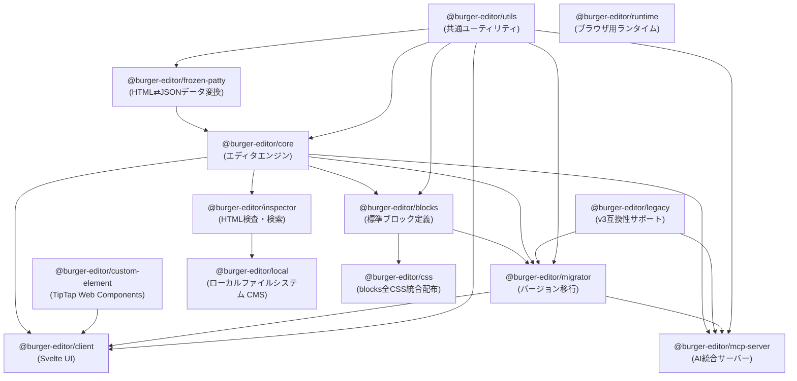

# BurgerEditor v4 Architecture

## モノレポ構成

BurgerEditor v4は、再利用性とプラットフォーム非依存性を重視したモノレポ構成を採用しています。

### パッケージ構成と依存関係



### 各パッケージの責任

#### Core Layer（コア層）

**`@burger-editor/utils`**

- 共通ユーティリティ関数
- 依存関係: dayjs, marked, turndown
- 責任: 日付処理、マークダウン変換等の汎用機能

**`@burger-editor/frozen-patty`**

- HTMLとJSONデータの相互変換ライブラリ
- 依存関係: utils
- 責任: HTMLからのデータ抽出、JSONからHTMLへの適用、XSS対策
- 特徴: テンプレートエンジン不要、`data-field`属性ベースのマッピング

**`@burger-editor/core`**

- エディタエンジンの中核実装
- 依存関係: frozen-patty, utils, jaco, semver
- 責任: ブロック管理、編集機能、イベント処理
- **プラットフォーム非依存**: どのCMSでも利用可能

#### Content Layer（コンテンツ層）

**`@burger-editor/blocks`**

- 標準ブロックとアイテムの定義
- 依存関係: core, utils
- 責任: HTMLテンプレート、ブロック仕様、デフォルトカタログ

#### UI Layer（UI層）

**`@burger-editor/client`**

- Svelteベースのクライアント側UI
- 依存関係: core, custom-element, migrator, utils
- 責任: ブロック選択UI、ファイル管理UI、エディタUI

**`@burger-editor/custom-element`**

- TipTap統合のWeb Components
- 依存関係: @tiptap/\* packages
- 責任: WYSIWYG編集機能

#### Platform Layer（プラットフォーム層）

**`@burger-editor/inspector`**

- HTML検査・検索ユーティリティ
- 依存関係: core, jsdom
- 責任: HTML解析、CSS変数検索、jsdom互換性サポート
- **プラットフォーム非依存**: Node.js環境で動作
- **主要機能**:
  - CSS変数検索（シンプル、ワイルドカード、OR、AND検索）
  - jsdom要素のブラウザAPI互換化
  - DOM解析ユーティリティ
- **jsdom互換性**:
  - jsdomの`CSSStyleDeclaration`はiterableではないため、Proxyを使用してブラウザAPI互換にする
  - `proxyJsdomElementForIterableStyle`関数で`el.style`をiterableにラップ
  - coreの`exportStyleOptions`をそのまま再利用可能
- **将来の拡張**:
  - ブロック構造検索
  - アイテム検索
  - コンテンツ検索
  - 依存関係分析

**`@burger-editor/local`**

- ローカルファイルシステム向けCMS実装
- 依存関係: inspector, Hono, Node.js関連パッケージ
- 責任: ローカルサーバー、ファイルIO、設定管理、CLI機能、プログラマティックAPI
- **環境固有**: ローカルファイルシステム専用
- **CLI機能**:
  - `bge` - 開発サーバー起動
  - `bge search` - HTML内のCSS変数検索（`@burger-editor/inspector`を使用）
- **プログラマティックAPI**:
  - ファイルアップロード機能をプログラムから利用可能
  - Honoサーバーと同じロジックを共有
  - `EncodedFileName` 型で誤ったファイル名を防止
  - エクスポート:
    - `@burger-editor/local/get-candidate-name` - ファイル名候補生成
    - `@burger-editor/local/upload` - ファイルアップロード
- **内部構造**:
  - `helpers/scan-directory.ts` - ファイルスキャン共通ロジック（EXCLUDE_FILE_NAMES定義）
  - `helpers/get-max-file-id.ts` - 最大ファイルID取得
  - `helpers/get-candidate-name.ts` - 候補ファイル名生成（EncodedFileName型エクスポート）
  - `helpers/upload.ts` - ファイルアップロード実装
  - `model/FileListManager` - 上記helpers関数を使用してアップロード処理を実装

#### Support Layer（サポート層）

**`@burger-editor/migrator`**

- バージョン間移行機能
- 依存関係: blocks, core, legacy, utils

**`@burger-editor/mcp-server`**

- MCP (Model Context Protocol) サーバー実装
- 依存関係: core, legacy, migrator, utils
- 責任: AIアシスタント（Claude等）にBurgerEditor機能を提供
- 機能: ブロック作成、パラメータ取得、v3互換性サポート

**`@burger-editor/legacy`**

- v3互換性サポート
- 依存関係: なし

**`@burger-editor/css`**

- blocksの全CSSファイル（general.css + 各アイテムのstyle.css）を統合配布
- 依存関係: blocks（ビルド時）
- 責任: blocksのスタイルを単独で利用可能にする配布パッケージ

**`@burger-editor/runtime`**

- BurgerEditorで生成されたコンテンツをブラウザで動作させるためのランタイムライブラリ
- 依存関係: なし（独立パッケージ）
- 責任: ブラウザ側のインタラクティブ機能の提供
- **プラットフォーム非依存**: どのCMSで生成されたコンテンツでも利用可能
- **主要機能**:
  - 画像モーダル表示（Invoker Commands API使用）
  - 将来的な拡張機能の基盤

## アーキテクチャ原則

### 1. レイヤー分離

各レイヤーは明確な責任を持ち、上位レイヤーのみが下位レイヤーに依存します：

- **Platform Layer**: 特定環境への統合機能
- **UI Layer**: ユーザーインターフェース
- **Content Layer**: コンテンツ構造定義
- **Core Layer**: プラットフォーム非依存のエンジン

### 2. プラットフォーム非依存性

**Core Layer**は特定のプラットフォームに依存しない設計により、WordPress、MovableType、その他のCMSで再利用可能です。

### 3. 機能配置の判断基準

新機能を実装する際の配置判断：

**Core Layerに配置する機能:**

- 全プラットフォームで共通して必要な機能
- エディタの基本動作に関わる機能
- 例: ブロック管理、編集状態管理、イベント処理

**Platform Layerに配置する機能:**

- 特定環境に依存する機能
- 環境固有の設定や統合機能
- 例: ファイルシステム操作、サーバー設定、環境固有API

## モノレポ構成の利点

### 1. 協調的バージョン管理

- 全パッケージが協調してリリース
- 互換性の保証

### 2. 段階的統合

- core → blocks → client の段階的機能統合
- 依存関係の明確化

### 3. プラットフォーム拡張性

- localパッケージと同様の構造で他プラットフォーム対応可能
- 共通機能の重複実装を回避

## Tiptap拡張機能の追加方法（コントリビュータ向け）

`@burger-editor/custom-element`パッケージにTiptap拡張機能を追加する際のガイドラインです。

### 1. Mark vs Node の判断

Tiptapには2種類の拡張タイプがあります：

#### Mark（マーク）

- **用途**: テキストレベルの装飾やフォーマット
- **特徴**:
  - インライン要素（`<strong>`, `<em>`, `<sup>`, `<sub>`など）
  - 複数のMarkを同時に適用可能（例：太字+斜体）
  - テキストに対して適用される
- **例**: bold, italic, underline, strikethrough, subscript, superscript, link

#### Node（ノード）

- **用途**: ブロックレベルの構造や要素
- **特徴**:
  - ブロック要素（`<p>`, `<h1>`, `<div>`, `<blockquote>`など）
  - 属性を持つことができる
  - 階層構造を持つ
- **例**: paragraph, heading, blockquote, bulletList, orderedList

### 2. 実装パターン

#### パターンA: 公式拡張機能を使用（推奨）

Tiptap公式拡張がある場合は、それを使用します。

**メリット**:

- 信頼性が高い
- メンテナンスされている
- エッジケースが考慮されている
- 相互排他性などの複雑な動作が実装済み

**実装例（subscript/superscript）**:

```typescript
// 1. 依存関係追加
// package.json
{
  "dependencies": {
    "@tiptap/extension-subscript": "^3.0.0",
    "@tiptap/extension-superscript": "^3.0.0"
  }
}

// 2. インポートして登録
// src/tiptap-extentions/index.ts
import Subscript from '@tiptap/extension-subscript';
import Superscript from '@tiptap/extension-superscript';

export const BgeWysiwygEditorKit = Extension.create({
  name: 'bge-wysiwyg-editor-kit',
  addExtensions() {
    return [
      Subscript,
      Superscript,
      // ...
    ];
  },
});
```

#### パターンB: カスタム拡張機能を実装

独自の属性や動作が必要な場合は、カスタム拡張を実装します。

**実装例（ParagraphWithAlign）**:

```typescript
// src/tiptap-extentions/paragraph-with-align.ts
import Paragraph from '@tiptap/extension-paragraph';

declare module '@tiptap/core' {
	interface Commands<ReturnType> {
		paragraphWithAlign: {
			setAlign: (alignment: ParagraphAlignment) => ReturnType;
			unsetAlign: () => ReturnType;
			toggleAlign: (alignment: ParagraphAlignment) => ReturnType;
		};
	}
}

export type ParagraphAlignment = 'start' | 'center' | 'end';

export const ParagraphWithAlign = Paragraph.extend({
	name: 'paragraph', // 既存のParagraphを上書き

	addAttributes() {
		return {
			...this.parent?.(), // 親の属性を継承
			'data-bgc-align': {
				default: null,
				parseHTML: (element) => {
					const align = element.dataset.bgcAlign;
					// バリデーション: 不正な値はnullに
					if (align && ['start', 'center', 'end'].includes(align)) {
						return align;
					}
					return null;
				},
				renderHTML: (attributes) => {
					if (!attributes['data-bgc-align']) {
						return {}; // 属性なしの場合はHTMLに出力しない
					}
					return {
						'data-bgc-align': attributes['data-bgc-align'],
					};
				},
			},
		};
	},

	addCommands() {
		return {
			setAlign:
				(alignment) =>
				({ commands }) => {
					return commands.updateAttributes('paragraph', {
						'data-bgc-align': alignment,
					});
				},
			unsetAlign:
				() =>
				({ commands }) => {
					return commands.resetAttributes('paragraph', 'data-bgc-align');
				},
			toggleAlign:
				(alignment) =>
				({ commands, editor }) => {
					// トグル動作: 同じalignmentなら解除、異なればset
					if (editor.isActive('paragraph', { 'data-bgc-align': alignment })) {
						return commands.unsetAlign();
					}
					return commands.setAlign(alignment);
				},
		};
	},
});
```

### 3. 実装チェックリスト

新しいTiptap拡張を追加する際は、以下の手順に従ってください：

#### ステップ1: 依存関係の追加

- [ ] `packages/@burger-editor/custom-element/package.json`に依存関係を追加
- [ ] `yarn install`を実行

#### ステップ2: 拡張機能の作成/インポート

- [ ] 公式拡張の場合: `src/tiptap-extentions/index.ts`でインポート
- [ ] カスタム拡張の場合: `src/tiptap-extentions/`に新規ファイル作成
- [ ] カスタム拡張の場合: TypeScript型定義を追加（`declare module '@tiptap/core'`）
- [ ] `BgeWysiwygEditorKit`の`addExtensions()`に追加

#### ステップ3: TypeScript型定義の更新

- [ ] `src/bge-wysiwyg-element/types.ts`の`EditorNode`型に追加

```typescript
type EditorNode =
	| 'bold'
	| 'subscript' // 追加例
	| 'superscript' // 追加例
	| 'alignStart'; // 追加例
// ...
```

#### ステップ4: BgeWysiwygElementの更新

- [ ] `src/bge-wysiwyg-element/index.ts`にメソッドを追加

```typescript
toggleSubscript() {
  this.editor.chain().focus().toggleSubscript().run();
}
```

- [ ] `#transaction()`メソッドにステート情報を追加

```typescript
subscript: {
  disabled: !editor.can().chain().focus().toggleSubscript().run(),
  active: editor.isActive('subscript'),
},
```

#### ステップ5: ツールバー統合（オプション）

- [ ] `src/bge-wysiwyg-editor-element/index.ts`のアイコンをインポート

```typescript
import IconSubscript from '@tabler/icons/outline/subscript.svg?raw';
```

- [ ] `static defaultCommands`配列にコマンド名を追加

```typescript
static defaultCommands = [
  'bold',
  'subscript',  // 追加
  // ...
] as const;
```

- [ ] テンプレート内にボタンHTMLを追加

```typescript
${commands.includes('subscript') ?
  `<button type="button" data-bge-toolbar-button="subscript">${IconSubscript}</button>`
  : ''}
```

- [ ] `bindToggle()`関数にハンドラを追加

```typescript
case 'subscript': {
  wysiwygElement.toggleSubscript();
  break;
}
```

- [ ] `updateButtonState()`関数にステート更新を追加

```typescript
case 'subscript': {
  button.disabled = state.subscript.disabled;
  button.ariaPressed = state.subscript.active ? 'true' : 'false';
  break;
}
```

#### ステップ6: テストの追加

- [ ] `src/bge-wysiwyg-element/index.spec.ts`に以下のテストを追加:
  - 要素が保持されるか（`expectHTML`テスト）
  - 属性が保持されるか（カスタム属性の場合）
  - 不正な値が適切に処理されるか（カスタム属性の場合）
  - HTMLモードとWysiwygモードの切り替えが可能か
  - 構造変更として検出されないか（`hasStructureChange`テスト）

**テスト例**:

```typescript
test('expectHTML preserves <sup> elements correctly', () => {
	document.body.innerHTML = '<bge-wysiwyg><p>x<sup>2</sup></p></bge-wysiwyg>';
	const element = document.querySelector('bge-wysiwyg') as BgeWysiwygElement;
	const originalHTML = '<p>x<sup>2</sup></p>';
	const expectedHTML = element.expectHTML(originalHTML);
	expect(expectedHTML).toBe('<p>x<sup>2</sup></p>');
});

test('expectHTML preserves data-bgc-align attribute', () => {
	document.body.innerHTML =
		'<bge-wysiwyg><p data-bgc-align="center">Text</p></bge-wysiwyg>';
	const element = document.querySelector('bge-wysiwyg') as BgeWysiwygElement;
	const originalHTML = '<p data-bgc-align="center">Text</p>';
	const expectedHTML = element.expectHTML(originalHTML);
	expect(expectedHTML).toBe('<p data-bgc-align="center">Text</p>');
});
```

#### ステップ7: ドキュメントの更新

- [ ] `packages/@burger-editor/custom-element/README.md`の「使用可能なコマンド」セクションに追加
- [ ] 必要に応じて依存関係リストを更新

#### ステップ8: 検証

```bash
yarn lint   # コードの静的解析
yarn build  # ビルド確認
yarn test   # テスト実行
```

### 4. よくある落とし穴と注意点

#### 4.1 ツールバーボタンが表示されない

**原因**: `defaultCommands`配列への追加漏れ

**解決方法**: `src/bge-wysiwyg-editor-element/index.ts`の`static defaultCommands`に必ずコマンド名を追加する

#### 4.2 カスタム属性が保持されない

**原因**: `parseHTML`と`renderHTML`の実装漏れ

**解決方法**:

- `parseHTML`: DOM要素から属性を読み取る
- `renderHTML`: 属性をHTML出力に含める
- nullの場合は空オブジェクト`{}`を返す（属性なしで出力）

#### 4.3 不正な属性値が残る

**原因**: バリデーション不足

**解決方法**: `parseHTML`内で値を検証し、不正な値は`null`を返す

```typescript
parseHTML: (element) => {
  const value = element.getAttribute('data-custom');
  if (value && ['valid1', 'valid2'].includes(value)) {
    return value;
  }
  return null;  // 不正な値は削除
},
```

#### 4.4 Paragraph拡張が反映されない

**原因**: StarterKitのParagraphが優先されている

**解決方法**: カスタムParagraph拡張を`BgeWysiwygEditorKit`でロードする（StarterKitより後に読み込まれるため上書きされる）

#### 4.5 構造変更として検出される

**原因**: Tiptapが要素を認識できず、再構築している

**解決方法**:

- 拡張機能が正しく登録されているか確認
- `parseHTML`と`renderHTML`の実装を確認
- テストで`hasStructureChange`をチェック

### 5. デバッグ方法

#### Transactionイベントのリスン

```typescript
const editor = document.querySelector('bge-wysiwyg') as BgeWysiwygElement;
editor.addEventListener('transaction', (event: CustomEvent) => {
	console.log('Transaction state:', event.detail.state);
});
```

#### エディタの内部状態確認

```typescript
const editor = document.querySelector('bge-wysiwyg') as BgeWysiwygElement;
console.log('Active marks:', editor.editor.state.storedMarks);
console.log('Current node:', editor.editor.state.selection.$from.parent);
```

#### HTML出力の確認

```typescript
const editor = document.querySelector('bge-wysiwyg') as BgeWysiwygElement;
console.log('Output HTML:', editor.editor.getHTML());
```

### 6. 実装例: sup/sub/paragraph alignmentの追加

実際の実装例として、subscript, superscript, paragraph alignment機能の実装を参照してください：

- **機能**: テキストの上付き・下付き文字、段落整列
- **実装ファイル**:
  - `src/tiptap-extentions/paragraph-with-align.ts` - カスタム拡張
  - `src/tiptap-extentions/index.ts` - 統合
  - `src/bge-wysiwyg-element/index.ts` - メソッド・ステート
  - `src/bge-wysiwyg-editor-element/index.ts` - ツールバー
  - `src/bge-wysiwyg-element/index.spec.ts` - テスト

この実装は本ガイドのベストプラクティスに従っており、参考になります。

## 未確認事項

以下の項目について確認が必要です：

1. **モノレポ構成の選択理由**
   - 技術的制約や設計思想の詳細

2. **将来のプラットフォーム拡張計画**
   - WordPress、MovableType等の具体的な対応予定

3. **レイヤー間の厳密な境界定義**
   - インターフェース設計の詳細ルール
