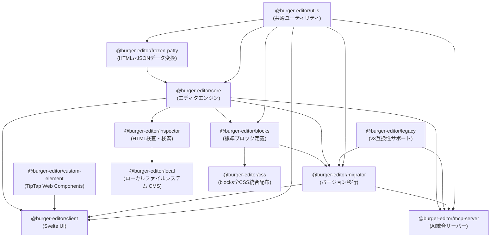

# BurgerEditor v4 Architecture

## モノレポ構成

BurgerEditor v4は、再利用性とプラットフォーム非依存性を重視したモノレポ構成を採用しています。

### パッケージ構成と依存関係

### 各パッケージの責任

#### Core Layer（コア層）

**`@burger-editor/utils`**

- 共通ユーティリティ関数
- 依存関係: dayjs, marked, turndown
- 責任: 日付処理、マークダウン変換等の汎用機能

**`@burger-editor/frozen-patty`**

- HTMLとJSONデータの相互変換ライブラリ
- 依存関係: utils
- 責任: HTMLからのデータ抽出、JSONからHTMLへの適用、XSS対策
- 特徴: テンプレートエンジン不要、`data-field`属性ベースのマッピング

**`@burger-editor/core`**

- エディタエンジンの中核実装
- 依存関係: frozen-patty, utils, jaco, semver
- 責任: ブロック管理、編集機能、イベント処理
- **プラットフォーム非依存**: どのCMSでも利用可能

#### Content Layer（コンテンツ層）

**`@burger-editor/blocks`**

- 標準ブロックとアイテムの定義
- 依存関係: core, utils
- 責任: HTMLテンプレート、ブロック仕様、デフォルトカタログ

#### UI Layer（UI層）

**`@burger-editor/client`**

- Svelteベースのクライアント側UI
- 依存関係: core, custom-element, migrator, utils
- 責任: ブロック選択UI、ファイル管理UI、エディタUI

**`@burger-editor/custom-element`**

- TipTap統合のWeb Components
- 依存関係: @tiptap/\* packages
- 責任: WYSIWYG編集機能

#### Platform Layer（プラットフォーム層）

**`@burger-editor/inspector`**

- HTML検査・検索ユーティリティ
- 依存関係: core, jsdom
- 責任: HTML解析、CSS変数検索、jsdom互換性サポート
- **プラットフォーム非依存**: Node.js環境で動作
- **主要機能**:
  - CSS変数検索（シンプル、ワイルドカード、OR、AND検索）
  - jsdom要素のブラウザAPI互換化
  - DOM解析ユーティリティ
- **jsdom互換性**:
  - jsdomの`CSSStyleDeclaration`はiterableではないため、Proxyを使用してブラウザAPI互換にする
  - `proxyJsdomElementForIterableStyle`関数で`el.style`をiterableにラップ
  - coreの`exportStyleOptions`をそのまま再利用可能
- **将来の拡張**:
  - ブロック構造検索
  - アイテム検索
  - コンテンツ検索
  - 依存関係分析

**`@burger-editor/local`**

- ローカルファイルシステム向けCMS実装
- 依存関係: inspector, Hono, Node.js関連パッケージ
- 責任: ローカルサーバー、ファイルIO、設定管理、CLI機能
- **環境固有**: ローカルファイルシステム専用
- **CLI機能**:
  - `bge` - 開発サーバー起動
  - `bge search` - HTML内のCSS変数検索（`@burger-editor/inspector`を使用）

#### Support Layer（サポート層）

**`@burger-editor/migrator`**

- バージョン間移行機能
- 依存関係: blocks, core, legacy, utils

**`@burger-editor/mcp-server`**

- MCP (Model Context Protocol) サーバー実装
- 依存関係: core, legacy, migrator, utils
- 責任: AIアシスタント（Claude等）にBurgerEditor機能を提供
- 機能: ブロック作成、パラメータ取得、v3互換性サポート

**`@burger-editor/legacy`**

- v3互換性サポート
- 依存関係: なし

**`@burger-editor/css`**

- blocksの全CSSファイル（general.css + 各アイテムのstyle.css）を統合配布
- 依存関係: blocks（ビルド時）
- 責任: blocksのスタイルを単独で利用可能にする配布パッケージ

## アーキテクチャ原則

### 1. レイヤー分離

各レイヤーは明確な責任を持ち、上位レイヤーのみが下位レイヤーに依存します：

- **Platform Layer**: 特定環境への統合機能
- **UI Layer**: ユーザーインターフェース
- **Content Layer**: コンテンツ構造定義
- **Core Layer**: プラットフォーム非依存のエンジン

### 2. プラットフォーム非依存性

**Core Layer**は特定のプラットフォームに依存しない設計により、WordPress、MovableType、その他のCMSで再利用可能です。

### 3. 機能配置の判断基準

新機能を実装する際の配置判断：

**Core Layerに配置する機能:**

- 全プラットフォームで共通して必要な機能
- エディタの基本動作に関わる機能
- 例: ブロック管理、編集状態管理、イベント処理

**Platform Layerに配置する機能:**

- 特定環境に依存する機能
- 環境固有の設定や統合機能
- 例: ファイルシステム操作、サーバー設定、環境固有API

## モノレポ構成の利点

### 1. 協調的バージョン管理

- 全パッケージが協調してリリース
- 互換性の保証

### 2. 段階的統合

- core → blocks → client の段階的機能統合
- 依存関係の明確化

### 3. プラットフォーム拡張性

- localパッケージと同様の構造で他プラットフォーム対応可能
- 共通機能の重複実装を回避

## 未確認事項

以下の項目について確認が必要です：

1. **モノレポ構成の選択理由**
   - 技術的制約や設計思想の詳細

2. **将来のプラットフォーム拡張計画**
   - WordPress、MovableType等の具体的な対応予定

3. **レイヤー間の厳密な境界定義**
   - インターフェース設計の詳細ルール
