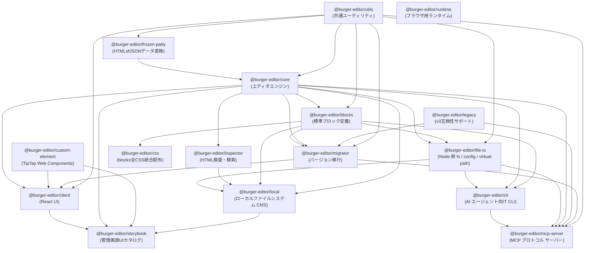

# BurgerEditor v4 Architecture

## モノレポ構成

BurgerEditor v4は、再利用性とプラットフォーム非依存性を重視したモノレポ構成を採用しています。

### パッケージ構成と依存関係


```mermaid
graph TD
    utils["@burger-editor/utils<br/>(共通ユーティリティ)"]
    frozen["@burger-editor/frozen-patty<br/>(HTML⇄JSONデータ変換)"]
    core["@burger-editor/core<br/>(エディタエンジン)"]
    blocks["@burger-editor/blocks<br/>(標準ブロック定義)"]
    client["@burger-editor/client<br/>(React UI)"]
    custom["@burger-editor/custom-element<br/>(TipTap Web Components)"]
    migrator["@burger-editor/migrator<br/>(バージョン移行)"]
    inspector["@burger-editor/inspector<br/>(HTML検査・検索)"]
    fileio["@burger-editor/file-io<br/>(Node 側 fs / config / virtual-path)"]
    cli["@burger-editor/cli<br/>(AI エージェント向け CLI)"]
    local["@burger-editor/local<br/>(ローカルファイルシステム CMS)"]
    mcp["@burger-editor/mcp-server<br/>(MCP プロトコル サーバー)"]
    legacy["@burger-editor/legacy<br/>(v3互換性サポート)"]
    css["@burger-editor/css<br/>(blocks全CSS統合配布)"]
    runtime["@burger-editor/runtime<br/>(ブラウザ用ランタイム)"]
    storybook["@burger-editor/storybook<br/>(管理画面UIカタログ)"]

    %% Core dependencies
    utils --> frozen
    frozen --> core
    utils --> core

    %% Block dependencies
    core --> blocks
    utils --> blocks

    %% CSS distribution
    blocks --> css

    %% Client dependencies
    core --> client
    custom --> client
    migrator --> client
    utils --> client

    %% Migrator dependencies
    blocks --> migrator
    core --> migrator
    legacy --> migrator
    utils --> migrator

    %% Inspector dependencies
    core --> inspector

    %% File-IO (Node 側集約)
    core --> fileio
    blocks --> fileio
    utils --> fileio

    %% Local dependencies (file-io 経由で fs を扱うようリファクタ済み)
    fileio --> local
    inspector --> local
    blocks --> local
    core --> local

    %% CLI (AI エージェント向け)
    fileio --> cli
    core --> cli
    blocks --> cli

    %% MCP Server (v3 互換 + v4 ツールは CLI 経由)
    cli --> mcp
    fileio --> mcp
    core --> mcp
    legacy --> mcp
    migrator --> mcp
    utils --> mcp

    %% Storybook (開発時のコンポーネントカタログ、他パッケージからは依存されない末端)
    client --> storybook
    core --> storybook
    custom --> storybook
    local --> storybook

    %% Independent packages
    legacy
    runtime
```

### 各パッケージの責任

#### Core Layer（コア層）

**`@burger-editor/utils`**

- 共通ユーティリティ関数
- 依存関係: dayjs, marked, turndown
- 責任: 日付処理、マークダウン変換等の汎用機能

**`@burger-editor/frozen-patty`**

- HTMLとJSONデータの相互変換ライブラリ
- 依存関係: utils
- 責任: HTMLからのデータ抽出、JSONからHTMLへの適用、XSS対策
- 特徴: テンプレートエンジン不要、`data-field`属性ベースのマッピング

**`@burger-editor/core`**

- エディタエンジンの中核実装
- 依存関係: frozen-patty, utils, jaco, semver
- 責任: ブロック管理、編集機能、イベント処理
- **プラットフォーム非依存**: どのCMSでも利用可能

#### Content Layer（コンテンツ層）

**`@burger-editor/blocks`**

- 標準ブロックとアイテムの定義
- 依存関係: core, utils
- 責任: HTMLテンプレート、ブロック仕様、デフォルトカタログ

#### UI Layer（UI層）

**`@burger-editor/client`**

- ReactベースのクライアントUI
- 依存関係: core, custom-element, migrator, utils, react
- 責任: 編集エリアシェル（iframe/ソース表示・高さ追従を担う `EditableAreaView`）、ブロック選択UI、ファイル管理UI、エディタUI（ダイアログ群を `engine.uiState` から宣言的にレンダリング）、エンジンコマンドのディスパッチテーブル、アイテムエディタ用フォーム部品、Front Matter 編集UI（`createFrontMatterEditor` / `FrontMatterEditorView`。React実装のためUI層に置くが、`local` のFront Matterという概念自体には依存しない汎用コンポーネント）を `@burger-editor/client/ui` として公開

**`@burger-editor/custom-element`**

- TipTap統合のWeb Components
- 依存関係: @tiptap/\* packages
- 責任: WYSIWYG編集機能

#### Platform Layer（プラットフォーム層）

**`@burger-editor/file-io`**

- Node 側の fs / config / virtual-path-resolver 集約パッケージ
- 依存関係: core, blocks, utils, cosmiconfig, jsdom, prettier
- 責任: 設定ファイル（`burgereditor.config.*`）解決、ページ HTML の load/save、Front Matter 処理、ディレクトリツリー生成、仮想パス ↔ 実ファイルパスの双方向マッピング、Node から `@burger-editor/core` を使うための jsdom-backed DOM の遅延インストール
- **設計判断**:
  1. **shared by local & cli & mcp-server** — fs を触る全パッケージのフロントエンド。同じ config / 同じパス解釈 / 同じ Front Matter パーサを共有することで、ブラウザ UI 経由の編集と AI エージェント経由の編集が必ず一致する
  2. **遅延 DOM インストール** — `import '@burger-editor/file-io'` は `globalThis.document` / `DOMParser` 等のアクセサだけを置き、最初のアクセスで初めて JSDOM を構築する。DOM 不要な CLI コマンド（`catalog-list` 等）は JSDOM コストを払わない
  3. **cosmiconfig `searchStrategy: 'project'`** — サブディレクトリから CLI / MCP を起動してもプロジェクトルートの設定が見つかる
- **構成ファイル**:
  - `src/config/resolve.ts` — `resolveConfig(searchFrom?)` / `clearConfigCache()`
  - `src/document/edit-content.ts` — `loadContent` / `saveContent` / `FileNotFoundError`
  - `src/file-tree.ts` — `generateFileTree` / `buildFileTreeFromLogicalPaths`
  - `src/virtual-path-resolver.ts` — `loadResolverState` / `toDiskPath` 他（旧 local からの移植）
  - `src/path-input.ts` — `resolvePathInput`（実 / 仮想パス両対応、リーディング `/` を documentRoot 直下として解釈）
  - `src/dom-shim.ts` — jsdom-backed DOM の遅延インストール
- **詳細ドキュメント**: [`packages/@burger-editor/file-io/README.md`](packages/@burger-editor/file-io/README.md)

**`@burger-editor/cli`**

- AI エージェント / 非対話スクリプト向けの JSON-only CLI
- 依存関係: core, blocks, file-io, `@d-zero/roar`
- 責任: ページ / ブロック / Front Matter / カタログ / スタイルオプションの CRUD と参照を、JSON で stdout に返す
- **`bin: "@burger-editor/cli"`** — グローバルコマンド名を取らない。`npx @burger-editor/cli <subcommand>` で起動
- **設計判断**:
  1. **JSON-only stdout** — 成功時は単一 JSON 行のみ。ユーザー設定の `dotenv` バナー等は stderr にリダイレクトされ、最終 JSON は drain callback で確実に flush される
  2. **3-way spec input** — `--spec`（インライン）/ `--spec-file`（ファイル）/ stdin の優先順で受け取り。シェルクォート地獄を回避
  3. **atomic 操作** — `page-create` は `fs.writeFile(... flag: 'wx')` で原子的に reserve、`page-rename` は rename 失敗時に作成済みディレクトリを巻き戻す
  4. **ハンドラの再利用** — `src/handlers.ts` の各関数は `mcp-server` の v4 ツールがそのままラップして公開する
- **詳細ドキュメント**: [`packages/@burger-editor/cli/README.md`](packages/@burger-editor/cli/README.md)

**`@burger-editor/inspector`**

- HTML検査・検索ユーティリティ
- 依存関係: core, jsdom
- 責任: HTML解析、CSS変数検索、jsdom互換性サポート
- **プラットフォーム非依存**: Node.js環境で動作
- **主要機能**:
  - CSS変数検索（シンプル、ワイルドカード、OR、AND検索）
  - jsdom要素のブラウザAPI互換化
  - DOM解析ユーティリティ
- **jsdom互換性**:
  - jsdomの`CSSStyleDeclaration`はiterableではないため、Proxyを使用してブラウザAPI互換にする
  - `proxyJsdomElementForIterableStyle`関数で`el.style`をiterableにラップ
  - coreの`exportStyleOptions`をそのまま再利用可能
- **将来の拡張**:
  - ブロック構造検索
  - アイテム検索
  - コンテンツ検索
  - 依存関係分析

**`@burger-editor/local`**

- ローカルファイルシステム向けCMS実装（Hono ベース HTTP + Hono JSX による SSR + ビルド済み client UI の埋め込み）
- 依存関係: core, file-io, blocks, inspector, Hono, Node.js関連パッケージ
- 責任: ローカルサーバー、ブラウザ UI、CLI機能（`bge dev` / `bge search`）、プログラマティックAPI
- **重要**: ファイル I/O / 設定解決 / virtual-path-resolver / Front Matter の本体は `@burger-editor/file-io` に移っており、local はそれを再エクスポートする薄いシムに痩身化されている。`local/src/helpers/{front-matter,html-detection,no-editable-area-error,edit-content}.ts` と `local/src/model/{file-tree,virtual-path-resolver,get-user-config}.ts` は互換性のためのシム re-export であり、本体は `@burger-editor/core` / `@burger-editor/file-io` 側を参照すること
- **環境固有**: ローカルファイルシステム専用
- **CLI機能**:
  - `bge` - 開発サーバー起動
  - `bge search` - HTML内のCSS変数検索（`@burger-editor/inspector`を使用）
- **プログラマティックAPI**:
  - ファイルアップロード機能をプログラムから利用可能
  - Honoサーバーと同じロジックを共有
  - `EncodedFileName` 型で誤ったファイル名を防止
  - エクスポート:
    - `@burger-editor/local/get-candidate-name` - ファイル名候補生成
    - `@burger-editor/local/upload` - ファイルアップロード
- **内部構造**:
  - `helpers/scan-directory.ts` - ファイルスキャン共通ロジック（EXCLUDE_FILE_NAMES定義）
  - `helpers/get-max-file-id.ts` - 最大ファイルID取得
  - `helpers/get-candidate-name.ts` - 候補ファイル名生成（EncodedFileName型エクスポート）
  - `helpers/upload.ts` - ファイルアップロード実装
  - `model/FileListManager` - 上記helpers関数を使用してアップロード処理を実装
- **Virtual File Tree（仮想ファイルツリー）**:
  - **何のための機能か**: `documentRoot` 配下を不透明な ID 名のフラットファイル群（`<id>.html`）として運用するプロジェクト向けに、Front Matter `path` から論理ツリーを再構築するオプトイン機能。外部 CMS 連携で命名権が無いケースを想定
  - **既定挙動**: `virtualTree.enabled = false`。完全に従来の「ディスク階層 = エディタツリー」モード
  - **設計判断**:
    1. **disk と論理を完全分離** — disk は触らない。Front Matter の値だけが論理ツリーの真実。これにより「いつでもオプトアウトできる」可逆性を担保
    2. **state の単一所有権** — モード分岐と `ResolverState` の保持は `route.tsx` 1 ファイルに閉じる。view / client は `virtualTreeEnabled` boolean しか知らない（疎結合）
    3. **`withStateLock` でシリアライズ** — `let resolverState = ...` の read-modify-write を mutex で囲む。シングルユーザー編集前提だが、tab 二枚での並行更新で state 損失が起きないようにする保険
    4. **2-phase commit** — `saveContent` 成功後にだけ state を進める。書き込み失敗時に state がディスクと乖離しない
  - **構成ファイル**:
    - `model/virtual-path-resolver.ts` - `ResolverState` 型と純関数群（`createEmptyState` / `loadResolverState` / `toDiskPath` / `toLogicalPath` / `listLogicalPaths` / `listEntries` / `registerEntry` / `setLogicalPath` / `deleteEntry`）。論理パスは内部で先頭スラッシュが除去されて正規化される。エラー語彙は `PathConflictError`（論理パス衝突）/ `IdAlreadyExistsError`（id 既使用）/ `EmptyLogicalPathError`（正規化後に空）の 3 種で、route 層がそれぞれ 409 / 409 / 400 にマップする
    - `model/file-tree.ts::buildFileTreeFromLogicalPaths` - 論理パス配列からツリー構造を組む純関数
    - `route.tsx` - mode フラグの評価点。`GET /api/tree` / `POST /api/content/create` / `POST /api/content` の 3 エンドポイントが state を read-modify-write。論理パス入力は `isSafeLogicalPath` で `..` / `.` セグメントと NUL 文字を 400 で拒否し、ブラウザ正規化により孤児ファイル化する事故を API 境界で防ぐ
    - `commands/load-resolver-state-or-exit.ts` - boot 時の `loadResolverState` 失敗を整形済み stderr + `process.exit(1)` に変換するラッパ。`PathConflictError` のメッセージがスタックトレースに埋もれないようにし、PM2 / systemd 等のプロセスマネージャが exit code を確実に観測できるようにする
    - `view/app.tsx` / `view/nav.tsx` - SSR 時に `virtualTreeEnabled` prop を hidden input + Nav の入力欄出し分けで埋め込む
    - `client/nav-tree.ts` - `/api/tree` を fetch して `#nav-tree-mount` をハイドレート。仮想モードで `FileInfo.id` が乗っている葉は `<論理ファイル名> (<id>)` 形式（末尾 `.html` は除去）でラベル化し、id 部分は `.file-id` クラスの `<span>` として独立させてテーマ側でスタイル可能にする
    - `client/new-file.ts` - hidden input で flag を読み、有効時のみ ID 入力を必須化して `/api/content/create` を叩く
    - `client/save-content-request.ts` - `/api/content` POST 後のレスポンス分岐（成功 / `{error}` / `saved: false` / 不正 JSON）を純関数として隔離。`create-editor.ts` 全体の DOM 配線を立ち上げずにレスポンス分岐の回帰を検証できる
  - **詳細ドキュメント**: [`packages/@burger-editor/local/docs/virtual-tree.md`](packages/@burger-editor/local/docs/virtual-tree.md)

#### Support Layer（サポート層）

**`@burger-editor/migrator`**

- バージョン間移行機能
- 依存関係: blocks, core, legacy, utils

**`@burger-editor/mcp-server`**

- MCP (Model Context Protocol) サーバー実装
- 依存関係: core, legacy, migrator, utils
- 責任: AIアシスタント（Claude等）にBurgerEditor機能を提供
- 機能:
  - v3 ツール 3 個（`create_block_v3` / `get_block_data_params_v3` / `get_block_type`）— v3 プロジェクト互換
  - v4 ツール 21 個 + 高レベルヘルパー 2 個（`update_page` / `duplicate_block`）— v4 プロジェクトのページ・ブロック CRUD、カタログ・スタイルオプションの参照を `@burger-editor/cli` のハンドラ経由で公開
  - `loadContext()` の結果はサーバープロセス内で 1 回だけ評価し、以降の全ツールで再利用（テスト用に `__resetV4ContextCache()` を export）

**`@burger-editor/legacy`**

- v3互換性サポート
- 依存関係: なし

**`@burger-editor/css`**

- blocksの全CSSファイル（general.css + 各アイテムのstyle.css）を統合配布
- 依存関係: blocks（ビルド時）
- 責任: blocksのスタイルを単独で利用可能にする配布パッケージ

**`@burger-editor/runtime`**

- BurgerEditorで生成されたコンテンツをブラウザで動作させるためのランタイムライブラリ
- 依存関係: なし（独立パッケージ）
- 責任: ブラウザ側のインタラクティブ機能の提供
- **プラットフォーム非依存**: どのCMSで生成されたコンテンツでも利用可能
- **主要機能**:
  - 画像モーダル表示（Invoker Commands API使用）
  - 将来的な拡張機能の基盤

**`@burger-editor/storybook`**

- Storybook（`@storybook/react-vite`）による管理画面UIコンポーネントカタログ
- 依存関係: client, core, custom-element, local（devDependencies、他パッケージからは依存されない末端）
- 責任: `@burger-editor/client` のコンポーネント群と `@burger-editor/local` の Front Matter 編集UI（`@burger-editor/client` 経由で公開）を、`engine` 等の実インスタンスなしに一覧・確認できるカタログを提供
- **private パッケージ**: publish 対象外。`yarn storybook`（開発起動）/ `yarn build-storybook`（静的ビルド）はルートから実行
- **見た目確認専用**: 見た目の回帰検知は既存の Playwright + pixelmatch VRT（`vitest --project vr`）が引き続き担う。Storybook 側に test-runner や Chromatic は導入しない
- **`engine` のモック方針**: `BurgerEditorEngine` は private constructor のため直接生成できない。`uiState`/`commandBus`/`componentObserver` は本物のクラスをそのまま `new` し、それ以外のメソッドだけを `src/mocks/create-mock-engine.ts` の `overrides` で個別に差し込む（各 `*.spec.tsx` に確立された `createMockEngine()` パターンを踏襲）。`BlockMenu` のようにマウス位置から `BurgerBlock` の実インスタンスを解決する設計のコンポーネントは、モックだけでは実表示を再現できないため、描画専用の子コンポーネント（`BlockMenuView`）を切り出してそちらをカタログ化する

## アーキテクチャ原則

### 1. レイヤー分離

各レイヤーは明確な責任を持ち、上位レイヤーのみが下位レイヤーに依存します：

- **Platform Layer**: 特定環境への統合機能
- **UI Layer**: ユーザーインターフェース
- **Content Layer**: コンテンツ構造定義
- **Core Layer**: プラットフォーム非依存のエンジン

### 2. プラットフォーム非依存性

**Core Layer**は特定のプラットフォームに依存しない設計により、WordPress、MovableType、その他のCMSで再利用可能です。

### 3. 機能配置の判断基準

新機能を実装する際の配置判断：

**Core Layerに配置する機能:**

- 全プラットフォームで共通して必要な機能
- エディタの基本動作に関わる機能
- 例: ブロック管理、編集状態管理、イベント処理

**UI Layerに配置する機能:**

- UIフレームワーク固有の実装（React コンポーネント等）
- core が定義する view port・UI状態ストアの具象実装
- 例: 編集エリアシェル、ブロックメニュー、初期挿入ボタン、ダイアログ群、アイテムエディタのフォーム

**Platform Layerに配置する機能:**

- 特定環境に依存する機能
- 環境固有の設定や統合機能
- 例: ファイルシステム操作、サーバー設定、環境固有API

### 4. headless core と宣言的 UI

core パッケージは UI フレームワークに依存しない headless エンジンです。UI 層（client パッケージ / React）は次の 2 つの接点で core と統合します。

**UIStateStore（`engine.uiState`）:**

「どのダイアログが開いているか」「エンジンが処理中か（`processing`）」「各編集エリアがソース編集モードか（`sourceMode`）」を表す外部ストア（`subscribe`/`getSnapshot`）。React 側は `useSyncExternalStore` で購読し、各 `<dialog>` やメニューの可視状態を宣言的にレンダリングします。エンジンを操作する側は `uiState.openBlockCatalog()` などの状態遷移を呼ぶだけで、UI を命令的に開閉しません。

**view port（単一の UI 注入点）:**

core が UI に要求する接点は `BurgerEditorView` ひとつです。`createAreaHost()` が編集エリア（main / draft）ごとのホスト UI を生成し、core には編集対象コンテンツの `containerElement`（と任意の挿入アニメーションフック）だけを返します。core は iframe・textarea・メニューなど UI 所有の DOM への参照を一切持たないため、「エンジンが React の描画対象属性を直接書き換えて状態が食い違う」類のバグは型レベルで表現できません。

- core 側: `EditableContent` がコンテンツ操作（ブロック復元・シリアライズ・サニタイズ）を担う。`view` 未指定時は素の div を返す headless フォールバックを使う
- client 側: `createReactView()` が port を実装し、`EditableAreaView`（iframe/ソース textarea のシェル、ResizeObserver による高さ追従）を React root としてマウント。ブロックメニューと初期挿入ボタンは createPortal で iframe 文書内に描画する
- 表示状態（main/draft の切替・visual/source モード・processing 中のメニュー非表示）は `engine.uiState` とエンジンイベント（`bge:switch-content` / `bge:saved`）を UI 層が購読して宣言的に描画する。core から UI への命令的呼び出しは存在しない

**依存関係の流れ:**

```
core（uiState ストア + view port 定義） ← client（React 実装を注入）
```

### 5. Invoker Commands API とコマンドバス

**clickイベント全面禁止**が本プロジェクトの規約です。`onClick` prop・`addEventListener('click')`・プログラムによる `click()` は ESLint（`no-restricted-syntax`）で禁止されており、ボタン起点のアクションはすべて HTML の `command`/`commandfor` 属性（Invoker Commands API）で宣言します。

**中央コマンドバス（`engine.commandBus`）:**

エンジン・文書・サーバー状態を変えるコマンド（`BGE_COMMAND`: ブロック移動・追加・削除・コピー、下書き切替、アイテムエディタ起動など）は、単一のディスパッチテーブルで処理されます。`commandfor` は同一 document 内の ID 参照であり `CommandEvent` はバブリングしないため、受信エレメント（`#bge-command-bus`）は親 document と各編集エリアの iframe の両方に設置されます。ディスパッチテーブルの実装は client の `registerEngineCommands()` にあり、「エンジンを動かす唯一の経路 = コマンド語彙」として一箇所で監査できます。

**ローカルコマンド:**

コンポーネントのビュー状態しか変えないコマンド（タブ選択、ページネーション、テーブル行操作など）は、コンポーネント自身のコンテナを `commandfor` で指し、`useCommand()` フックで受信します。

**アイテムエディタ契約:**

各アイテムは `createItem()` に `Editor`（型付き React コンポーネント）と純関数 `toEditorState` / `toItemData` を渡します。旧来の `editor.html` 文字列テンプレートと命令的ライフサイクルフック（`beforeOpen`/`open`/`beforeChange`/`onSubmit`）は廃止されました。コンテンツ出力側（`template.html` + frozen-patty の `data-bge` バインディング）は従来どおりで、React には依存しません。

## テストアーキテクチャ

テストは vitest を使用し、パッケージごとに適切な実行環境を使い分けます。

| プロジェクト | 実行環境                        | 対象パッケージ               |
| ------------ | ------------------------------- | ---------------------------- |
| core         | Playwright Chromium（ブラウザ） | core, blocks, custom-element |
| client       | jsdom                           | client                       |

- core プロジェクト: iframe の `contentWindow` 等、実ブラウザ API が必要なテストはブラウザ環境で実行
- client プロジェクト: React コンポーネントのテストは jsdom 環境 + Testing Library で実行

## モノレポ構成の利点

### 1. 協調的バージョン管理

- 全パッケージが協調してリリース
- 互換性の保証

### 2. 段階的統合

- core → blocks → client の段階的機能統合
- 依存関係の明確化

### 3. プラットフォーム拡張性

- localパッケージと同様の構造で他プラットフォーム対応可能
- 共通機能の重複実装を回避

## 実験的機能（Experimental Features）

BurgerEditorでは、将来のAPIが確定していない機能を`experimental`プロパティ配下で提供する設計パターンを採用しています。

### 設計原則

1. **オプトイン方式**: 実験的機能はデフォルトで無効であり、明示的な設定により有効化
2. **後方互換性の保持**: 実験的機能が無効の場合、既存の動作を完全に維持
3. **APIの柔軟性**: 実験的機能のAPIは将来のバージョンで変更される可能性がある
4. **段階的安定化**: 実験的機能が成熟した場合、通常のAPIとして昇格

### 設定構造

```typescript
// Config型の実験的機能部分
{
	experimental?: {
		itemOptions?: {
			[itemName: string]: {
				// アイテム固有の実験的オプション
			};
		};
	};
}
```

### 実装例: テキスト編集モード

WYSIWYGエディタのテキスト編集モード機能は実験的機能として実装されています。

**設定フロー**:

1. ユーザーが`Config.experimental.itemOptions.wysiwyg.enableTextOnlyMode`を設定
2. `@burger-editor/core`の`BurgerEditorEngine`が設定を保持
3. `defineCustomElement`コールバックで`experimental`設定を渡す
4. `@burger-editor/client`が`defineBgeWysiwygEditorElement`に転送
5. `@burger-editor/custom-element`がUI動作を制御

**実装ファイル**:

- `packages/@burger-editor/core/src/types.ts` - Config型定義
- `packages/@burger-editor/core/src/engine/engine.ts` - 設定の伝搬
- `packages/@burger-editor/client/src/index.tsx` - カスタム要素への転送
- `packages/@burger-editor/custom-element/src/bge-wysiwyg-editor-element/index.ts` - UI制御

### 実験的機能の追加ガイドライン

新しい実験的機能を追加する際は、以下の手順に従ってください：

1. **Config型の拡張**: `@burger-editor/core/src/types.ts`の`Config.experimental`に追加
2. **設定の伝搬**: 必要に応じて`defineCustomElement`コールバックで設定を渡す
3. **デフォルト動作の保証**: 実験的機能が無効の場合、既存動作を維持するテストを追加
4. **ドキュメント更新**: 以下のファイルに実験的機能として明記
   - 影響するパッケージのREADME
   - `@burger-editor/core/README.md`の「設定 (Config)」セクション
   - このARCHITECTURE.mdファイル

## Tiptap拡張機能の追加方法（コントリビュータ向け）

`@burger-editor/custom-element`パッケージにTiptap拡張機能を追加する際のガイドラインです。

### 1. Mark vs Node の判断

Tiptapには2種類の拡張タイプがあります：

#### Mark（マーク）

- **用途**: テキストレベルの装飾やフォーマット
- **特徴**:
  - インライン要素（`<strong>`, `<em>`, `<sup>`, `<sub>`など）
  - 複数のMarkを同時に適用可能（例：太字+斜体）
  - テキストに対して適用される
- **例**: bold, italic, underline, strikethrough, subscript, superscript, link

#### Node（ノード）

- **用途**: ブロックレベルの構造や要素
- **特徴**:
  - ブロック要素（`<p>`, `<h1>`, `<div>`, `<blockquote>`など）
  - 属性を持つことができる
  - 階層構造を持つ
- **例**: paragraph, heading, blockquote, bulletList, orderedList

### 2. 実装パターン

#### パターンA: 公式拡張機能を使用（推奨）

Tiptap公式拡張がある場合は、それを使用します。

**メリット**:

- 信頼性が高い
- メンテナンスされている
- エッジケースが考慮されている
- 相互排他性などの複雑な動作が実装済み

**実装例（subscript/superscript）**:

```typescript
// 1. 依存関係追加
// package.json
{
  "dependencies": {
    "@tiptap/extension-subscript": "^3.0.0",
    "@tiptap/extension-superscript": "^3.0.0"
  }
}

// 2. インポートして登録
// src/tiptap-extentions/index.ts
import Subscript from '@tiptap/extension-subscript';
import Superscript from '@tiptap/extension-superscript';

export const BgeWysiwygEditorKit = Extension.create({
  name: 'bge-wysiwyg-editor-kit',
  addExtensions() {
    return [
      Subscript,
      Superscript,
      // ...
    ];
  },
});
```

#### パターンB: カスタム拡張機能を実装

独自の属性や動作が必要な場合は、カスタム拡張を実装します。

**実装例（ParagraphWithAlign）**:

```typescript
// src/tiptap-extentions/paragraph-with-align.ts
import Paragraph from '@tiptap/extension-paragraph';

declare module '@tiptap/core' {
	interface Commands<ReturnType> {
		paragraphWithAlign: {
			setAlign: (alignment: ParagraphAlignment) => ReturnType;
			unsetAlign: () => ReturnType;
			toggleAlign: (alignment: ParagraphAlignment) => ReturnType;
		};
	}
}

export type ParagraphAlignment = 'start' | 'center' | 'end';

export const ParagraphWithAlign = Paragraph.extend({
	name: 'paragraph', // 既存のParagraphを上書き

	addAttributes() {
		return {
			...this.parent?.(), // 親の属性を継承
			'data-bgc-align': {
				default: null,
				parseHTML: (element) => {
					const align = element.dataset.bgcAlign;
					// バリデーション: 不正な値はnullに
					if (align && ['start', 'center', 'end'].includes(align)) {
						return align;
					}
					return null;
				},
				renderHTML: (attributes) => {
					if (!attributes['data-bgc-align']) {
						return {}; // 属性なしの場合はHTMLに出力しない
					}
					return {
						'data-bgc-align': attributes['data-bgc-align'],
					};
				},
			},
		};
	},

	addCommands() {
		return {
			setAlign:
				(alignment) =>
				({ commands }) => {
					return commands.updateAttributes('paragraph', {
						'data-bgc-align': alignment,
					});
				},
			unsetAlign:
				() =>
				({ commands }) => {
					return commands.resetAttributes('paragraph', 'data-bgc-align');
				},
			toggleAlign:
				(alignment) =>
				({ commands, editor }) => {
					// トグル動作: 同じalignmentなら解除、異なればset
					if (editor.isActive('paragraph', { 'data-bgc-align': alignment })) {
						return commands.unsetAlign();
					}
					return commands.setAlign(alignment);
				},
		};
	},
});
```

### 3. 実装チェックリスト

新しいTiptap拡張を追加する際は、以下の手順に従ってください：

#### ステップ1: 依存関係の追加

- [ ] `packages/@burger-editor/custom-element/package.json`に依存関係を追加
- [ ] `yarn install`を実行

#### ステップ2: 拡張機能の作成/インポート

- [ ] 公式拡張の場合: `src/tiptap-extentions/index.ts`でインポート
- [ ] カスタム拡張の場合: `src/tiptap-extentions/`に新規ファイル作成
- [ ] カスタム拡張の場合: TypeScript型定義を追加（`declare module '@tiptap/core'`）
- [ ] `BgeWysiwygEditorKit`の`addExtensions()`に追加

#### ステップ3: TypeScript型定義の更新

- [ ] `src/bge-wysiwyg-element/types.ts`の`EditorNode`型に追加

```typescript
type EditorNode =
	| 'bold'
	| 'subscript' // 追加例
	| 'superscript' // 追加例
	| 'alignStart'; // 追加例
// ...
```

#### ステップ4: BgeWysiwygElementの更新

- [ ] `src/bge-wysiwyg-element/index.ts`にメソッドを追加

```typescript
toggleSubscript() {
  this.editor.chain().focus().toggleSubscript().run();
}
```

- [ ] `#transaction()`メソッドにステート情報を追加

```typescript
subscript: {
  disabled: !editor.can().chain().focus().toggleSubscript().run(),
  active: editor.isActive('subscript'),
},
```

#### ステップ5: ツールバー統合（オプション）

- [ ] `src/bge-wysiwyg-editor-element/index.ts`のアイコンをインポート

```typescript
import IconSubscript from '@tabler/icons/outline/subscript.svg?raw';
```

- [ ] `static defaultCommands`配列にコマンド名を追加

```typescript
static defaultCommands = [
  'bold',
  'subscript',  // 追加
  // ...
] as const;
```

- [ ] テンプレート内にボタンHTMLを追加

```typescript
// ボタンの起動はInvoker Commands（command/commandfor）で宣言する。
// clickハンドラは規約で禁止されているため、command属性が無いと動作しない
${commands.includes('subscript') ?
  `<button type="button" command="--wysiwyg-toggle" commandfor="${this.id}" data-bge-toolbar-button="subscript">${IconSubscript}</button>`
  : ''}
```

- [ ] `bindToggle()`関数にハンドラを追加

```typescript
case 'subscript': {
  wysiwygElement.toggleSubscript();
  break;
}
```

- [ ] `updateButtonState()`関数にステート更新を追加

```typescript
case 'subscript': {
  button.disabled = state.subscript.disabled;
  button.ariaPressed = state.subscript.active ? 'true' : 'false';
  break;
}
```

#### ステップ6: テストの追加

- [ ] `src/bge-wysiwyg-element/index.spec.ts`に以下のテストを追加:
  - 要素が保持されるか（`expectHTML`テスト）
  - 属性が保持されるか（カスタム属性の場合）
  - 不正な値が適切に処理されるか（カスタム属性の場合）
  - HTMLモードとWysiwygモードの切り替えが可能か
  - 構造変更として検出されないか（`hasStructureChange`テスト）

**テスト例**:

```typescript
test('expectHTML preserves <sup> elements correctly', () => {
	document.body.innerHTML = '<bge-wysiwyg><p>x<sup>2</sup></p></bge-wysiwyg>';
	const element = document.querySelector('bge-wysiwyg') as BgeWysiwygElement;
	const originalHTML = '<p>x<sup>2</sup></p>';
	const expectedHTML = element.expectHTML(originalHTML);
	expect(expectedHTML).toBe('<p>x<sup>2</sup></p>');
});

test('expectHTML preserves data-bgc-align attribute', () => {
	document.body.innerHTML =
		'<bge-wysiwyg><p data-bgc-align="center">Text</p></bge-wysiwyg>';
	const element = document.querySelector('bge-wysiwyg') as BgeWysiwygElement;
	const originalHTML = '<p data-bgc-align="center">Text</p>';
	const expectedHTML = element.expectHTML(originalHTML);
	expect(expectedHTML).toBe('<p data-bgc-align="center">Text</p>');
});
```

#### ステップ7: ドキュメントの更新

- [ ] `packages/@burger-editor/custom-element/README.md`の「使用可能なコマンド」セクションに追加
- [ ] 必要に応じて依存関係リストを更新

#### ステップ8: 検証

```bash
yarn lint   # コードの静的解析
yarn build  # ビルド確認
yarn test   # テスト実行
```

### 4. よくある落とし穴と注意点

#### 4.1 ツールバーボタンが表示されない

**原因**: `defaultCommands`配列への追加漏れ

**解決方法**: `src/bge-wysiwyg-editor-element/index.ts`の`static defaultCommands`に必ずコマンド名を追加する

#### 4.2 カスタム属性が保持されない

**原因**: `parseHTML`と`renderHTML`の実装漏れ

**解決方法**:

- `parseHTML`: DOM要素から属性を読み取る
- `renderHTML`: 属性をHTML出力に含める
- nullの場合は空オブジェクト`{}`を返す（属性なしで出力）

#### 4.3 不正な属性値が残る

**原因**: バリデーション不足

**解決方法**: `parseHTML`内で値を検証し、不正な値は`null`を返す

```typescript
parseHTML: (element) => {
  const value = element.getAttribute('data-custom');
  if (value && ['valid1', 'valid2'].includes(value)) {
    return value;
  }
  return null;  // 不正な値は削除
},
```

#### 4.4 Paragraph拡張が反映されない

**原因**: StarterKitのParagraphが優先されている

**解決方法**: カスタムParagraph拡張を`BgeWysiwygEditorKit`でロードする（StarterKitより後に読み込まれるため上書きされる）

#### 4.5 構造変更として検出される

**原因**: Tiptapが要素を認識できず、再構築している

**解決方法**:

- 拡張機能が正しく登録されているか確認
- `parseHTML`と`renderHTML`の実装を確認
- テストで`hasStructureChange`をチェック

#### 4.6 カスタム属性のスタイルが適用されない

**原因**: 対応するCSSスタイルの追加漏れ

**解決方法**:

カスタム属性（特に見た目に影響するもの）を追加した場合、対応するCSSを`@burger-editor/blocks`パッケージに追加する必要があります。

1. **general.cssへの追加** - Wysiwyg内で使用する属性の場合

   ```css
   /* packages/@burger-editor/blocks/src/general.css */
   :where([data-bgc-align]) {
   	&[data-bgc-align='start'] {
   		text-align: start;
   	}
   	&[data-bgc-align='center'] {
   		text-align: center;
   	}
   	&[data-bgc-align='end'] {
   		text-align: end;
   	}
   }
   ```

2. **アイテム固有のstyle.cssへの追加** - 特定のアイテムでのみ使用する属性の場合

   各アイテムのディレクトリ内の`style.css`に追加します

**注意**: `@burger-editor/css`パッケージは`@burger-editor/blocks`のCSSを自動的に統合するため、blocksパッケージにスタイルを追加すれば、cssパッケージにも自動的に反映されます。

### 5. デバッグ方法

#### Transactionイベントのリスン

```typescript
const editor = document.querySelector('bge-wysiwyg') as BgeWysiwygElement;
editor.addEventListener('transaction', (event: CustomEvent) => {
	console.log('Transaction state:', event.detail.state);
});
```

#### エディタの内部状態確認

```typescript
const editor = document.querySelector('bge-wysiwyg') as BgeWysiwygElement;
console.log('Active marks:', editor.editor.state.storedMarks);
console.log('Current node:', editor.editor.state.selection.$from.parent);
```

#### HTML出力の確認

```typescript
const editor = document.querySelector('bge-wysiwyg') as BgeWysiwygElement;
console.log('Output HTML:', editor.editor.getHTML());
```

### 6. 実装例: sup/sub/paragraph alignmentの追加

実際の実装例として、subscript, superscript, paragraph alignment機能の実装を参照してください：

- **機能**: テキストの上付き・下付き文字、段落整列
- **実装ファイル**:
  - `src/tiptap-extentions/paragraph-with-align.ts` - カスタム拡張
  - `src/tiptap-extentions/index.ts` - 統合
  - `src/bge-wysiwyg-element/index.ts` - メソッド・ステート
  - `src/bge-wysiwyg-editor-element/index.ts` - ツールバー
  - `src/bge-wysiwyg-element/index.spec.ts` - テスト

この実装は本ガイドのベストプラクティスに従っており、参考になります。

## 未確認事項

以下の項目について確認が必要です：

1. **モノレポ構成の選択理由**
   - 技術的制約や設計思想の詳細

2. **将来のプラットフォーム拡張計画**
   - WordPress、MovableType等の具体的な対応予定

3. **レイヤー間の厳密な境界定義**
   - インターフェース設計の詳細ルール
